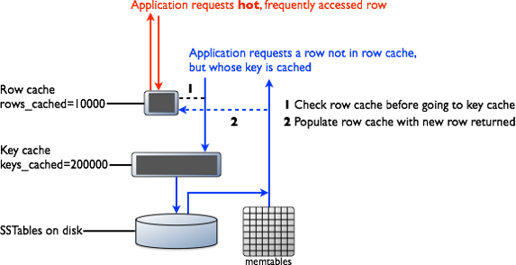

# 数据缓存

[1](#ref_1)Cassandra包含集成的分布式缓存支持。Cassandra的缓存内部会被定期保存到磁盘，机器重启时，缓存会从磁盘自动装载，因此，即使机器冷驱动，也不需要预热。

**Cassandra中有两个层次的缓存：**
* Partition key缓存
* 行缓存

## 缓存是如何工作的？

[2](#ref_2)如上图，一个读请求因为有行缓存，无需磁盘搜索就返回了。另一个读操作，行缓存找不到数据，但是命中partition key缓存，在访问了SSTable之后，数据会被保存到行缓存，然后返回。

## 高效缓存使用心得

[3](#ref_3)下面是一些缓存使用的心得：
* 对于访问不频繁的数据，尽量少使用或不使用缓存；
* 部署尽量多的Cassandra节点，降低每个节点的负载；
* 对频繁读的数据，尽量在逻辑上分割成多个具体的表；

## 参考

1. http://www.datastax.com/documentation/cassandra/2.0/cassandra/operations/ops_configuring_caches_c.html
2. http://www.datastax.com/documentation/cassandra/2.0/cassandra/operations/ops_how_cache_works_c.html
3. http://www.datastax.com/documentation/cassandra/2.0/cassandra/operations/ops_cache_tips_c.html
