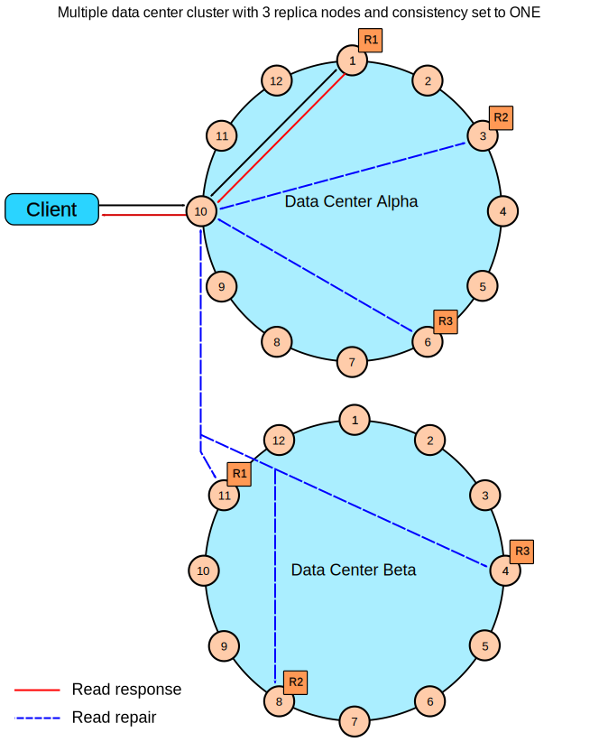

# 读请求

客户端请求需要读的replica数量，由客户端指定的consistency level决定。coordinator会将读请求发给响应最快的replica。如果多个节点返回了数据，coordinator会在内存中比较每一列的timestamp，返回合并后的最新的数据。

为了确保所有的replica对于经常访问的数据的一致性，在每一次读操作返回之后，coordinator会在后台同步所有其他replica上的该行数据，确保每个replica上拥有该行数据的最新版本。

## 举例

### 单数据中心，consistency level QUORUM

如果是单数据中心，replication factor值为3，读操作consistency level为QUORUM，那么，coordinator必须等待3个replica中的2个返回数据。 如果返回的数据版本不一致，合并后的最新的数据被返回。在后台，第三个replica的数据也会被检查，确保该行数据的最新版本在所有replica的一致性。

### 单数据中心，consistency level ONE

如果是单数据中心，replication factor值为3，读操作consistency level为ONE，coordinator访问并返回最近的replica返回的数据。在后台，其他两台replica的数据也会被检查，确保该行数据的最新版本在所有replica的一致性。

### 双数据中心，consistency level QUORUM

如果是双数据中心，replication factor值为3，读操作consistency level为QUORUM，coordinator必须等待4个replica返回数据。4个replica可以来自任意数据中心。在后台，其他所有数据中心的replica的数据也会被检查，确保该行数据的最新版本在所有replica的一致性。

### 双数据中心，consistency level LOCAL_QUORUM

如果是双数据中心，replication factor值为3，读操作consistency level为LOCAL_QUORUM, coordinator必须等待本地数据中心的2个replica返回数据。在后台，其他所有数据中心的replica的数据也会被检查，确保该行数据的最新版本在所有replica的一致性。

### 双数据中心，consistency level ONE

如果是双数据中心，replication factor值为3，读操作consistency level为ONE, coordinator访问并返回最近的replica返回的数据，无论该replica是本地数据中心的还是远程数据中心的。在后台，其他所有数据中心的replica的数据也会被检查，确保该行数据的最新版本在所有replica的一致性。

### 双数据中心，consistency level LOCAL_ONE

如果是双数据中心，replication factor值为3，读操作consistency level为LOCAL_ONE，coordinator访问并返回本地数据中心最近的replica返回的数据。在后台，其他所有数据中心的replica的数据也会被检查，确保该行数据的最新版本在所有replica的一致性。

### 使用speculative_retry做快速读保护（Rapid read protection）

快速读保护允许，即使coordinator最开始选择的replica节点down了或者超时了，依然能返回数据。如果一个表配置了speculative_retry参数，假如coordinator最先选择的replica读取超时，coordinator会尝试读取其他可用的replica代替。

