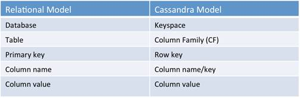
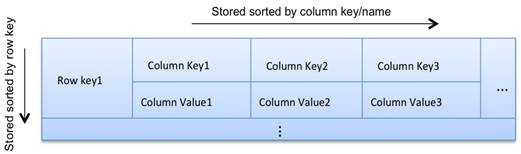

# 内部数据结构

<sup>[1](#ref_1)</sup>Cassandra的数据模型以列为中心。也就是说，不需要像关系型数据库那样事先定义一个表的所有列，每一行甚至可以包含不同名称的列。

<sup>[2](#ref_2)</sup>Cassandra的数据模型由keyspaces (类似关系型数据库里的database)，column families（类似关系型数据库里的table), 主键（keys）和列（columns）组成。



对于每一个column family，不要想象成关系型数据库的表，而要想像成一个多层嵌套的排序散列表（Nested sorted map）。这样能更好地理解和设计Cassandra的数据模型。

``` text
Map<RowKey, SortedMap<ColumnKey, ColumnValue>>
```



散列表能提供高效的键值查询，而排序的键值能提供高效率的范围查询能力。在Cassandra里，我们可以使用row key和column key做高效的键值查询和范围查询。每一行的列的数量最多允许多达20亿，换句话说，可以拥有所谓的宽行。

列的名称可以直接包含数据，换句话说，有的列可以只有列名没有列值。

## 参考

1. <a name="ref_1"></a>http://www.datastax.com/docs/0.8/ddl/index
2. <a name="ref_2"></a>http://www.bodhtree.com/blog/2013/12/06/my-experience-with-cassandra-concepts/
