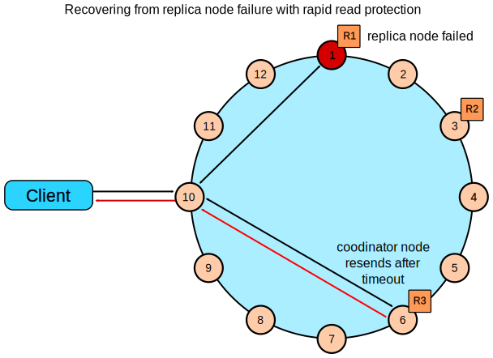

# Read Requests

The number of replicas contacted by a client read request is determined by the consistency level specified by the client. The coordinator sends these requests to the replicas that are currently responding the fastest. The nodes contacted respond with the requested data; if multiple nodes are contacted, the rows from each replica are compared in memory to see if they are consistent. If they are not, then the replica that has the most recent data (based on the timestamp) is used by the coordinator to forward the result back to the client.

To ensure that all replicas have the most recent version of frequently-read data, the coordinator also contacts and compares the data from all the remaining replicas that own the row in the background. If the replicas are inconsistent, the coordinator issues writes to the out-of-date replicas to update the row to the most recent values.

## Examples

### A single data center cluster with a consistency level of QUORUM

In a single data center cluster with a replication factor of 3, and a read consistency level of QUORUM, 2 of the 3 replicas for the given row must respond to fulfill the read request. If the contacted replicas have different versions of the row, the replica with the most recent version will return the requested data. In the background, the third replica is checked for consistency with the first two, and if needed, a read repair is initiated for the out-of-date replicas.

### A single data center cluster with a consistency level of ONE

In a single data center cluster with a replication factor of 3, and a read consistency level of ONE, the closest replica for the given row is contacted to fulfill the read request. In the background a read repair is potentially initiated, based on the read_repair_chance setting of the table, for the other replicas.

### A two data center cluster with a consistency level of QUORUM

In a two data center cluster with a replication factor of 3, and a read consistency of QUORUM, 4 replicas for the given row must resond to fulfill the read request. The 4 replicas can be from any data center. In the background, the remaining replicas are checked for consistency with the first four, and if needed, a read repair is initiated for the out-of-date replicas.

### A two data center cluster with a consistency level of LOCAL_QUORUM

In a multiple data center cluster with a replication factor of 3, and a read consistency of LOCAL_QUORUM, 2 replicas in the same data center as the coordinator node for the given row must respond to fulfill the read request. In the background, the remaining replicas are checked for consistency with the first 2, and if needed, a read repair is initiated for the out-of-date replicas.

### A two data center cluster with a consistency level of ONE

In a multiple data center cluster with a replication factor of 3, and a read consistency of ONE, the closest replica for the given row, regardless of data center, is contacted to fulfill the read request. In the background a read repair is potentially initiated, based on the read_repair_chance setting of the table, for the other replicas.

###A two data center cluster with a consistency level of LOCAL_ONE

In a multiple data center cluster with a replication factor of 3, and a read consistency of LOCAL_ONE, the closest replica for the given row in the same data center as the coodindator node is contacted to fulfill the read request. In the background a read repair is potentially initiated, based on the read_repair_chance setting of the table, for the other replicas.

### Rapid read protection using speculative_retry

Rapid read protection allows Cassandra to still deliver read requests when the originally selected replica nodes are either down or taking too long to respond. If the table has been configured with the speculative_retry property, the coordinator node for the read request will retry the request with another replica node if the original replica node exceeds a configurable timeout value to complete the read request.

